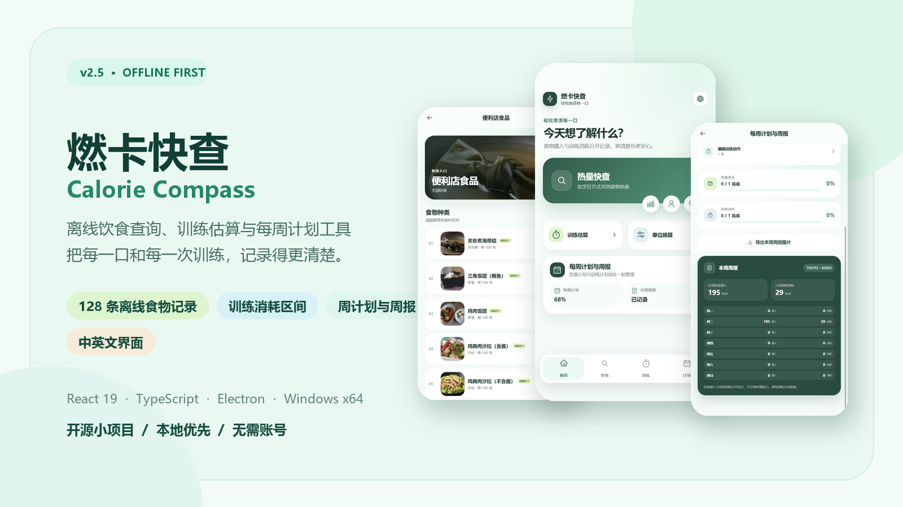
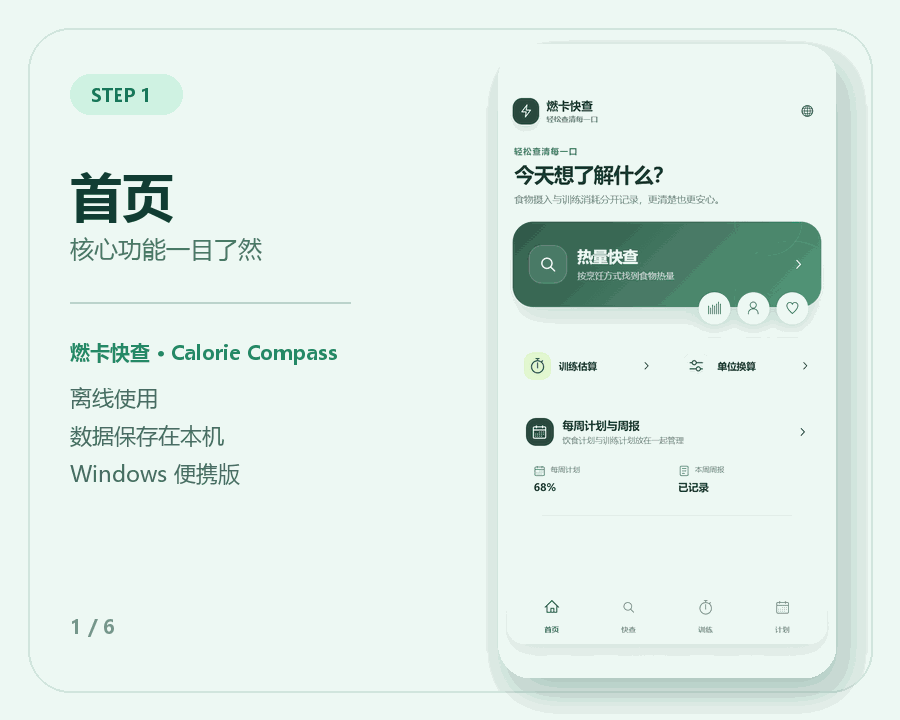
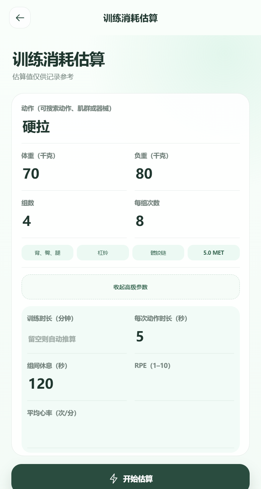
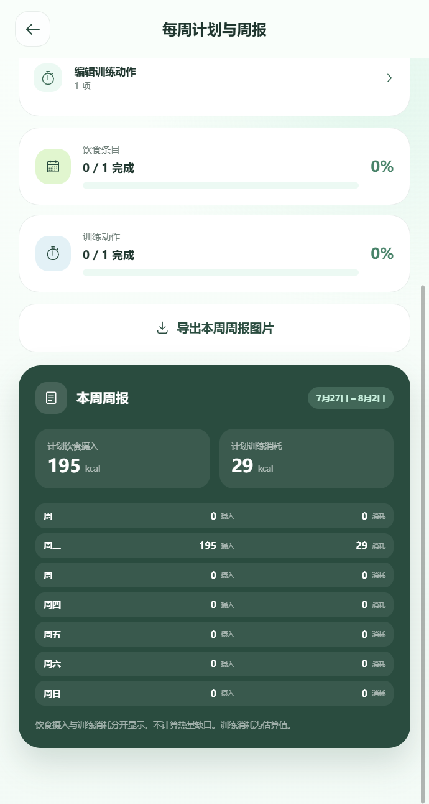
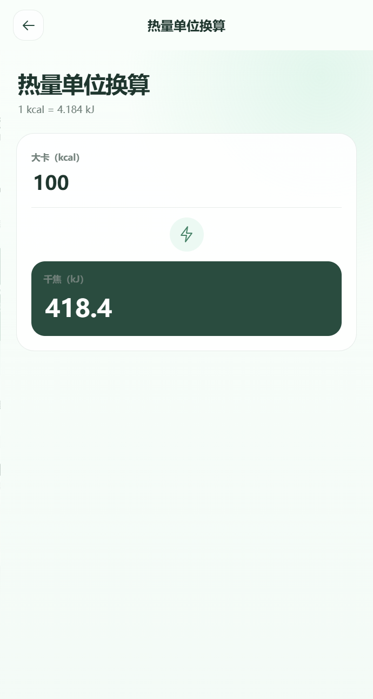
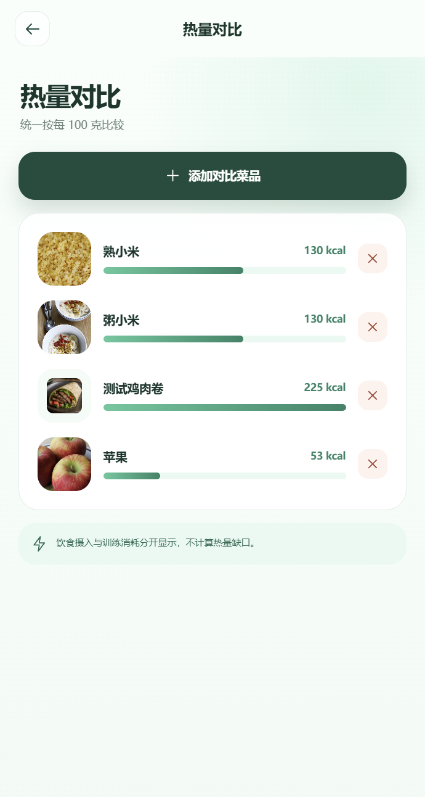

<div align="center">



# 燃卡快查 · Calorie Compass

**离线饮食查询、训练消耗估算与每周计划工具**  
把每一口和每一次训练，记录得更清楚。

[](package.json)
[](https://react.dev/)
[](https://www.typescriptlang.org/)
[](https://www.electronjs.org/)
[](#quick-start)
[](LICENSE)

[🎬 查看 Demo](#demo) · [🖼️ 功能截图](#screenshots) · [✨ 功能一览](#features) · [🚀 快速开始](#quick-start) · [⚠️ 数据说明](#data-disclaimer)

</div>

---

<a id="data-disclaimer"></a>

## ⚠️ 营养数据免责声明

> [!WARNING]
> 当前内置的食物热量、营养成分、份量以及训练消耗数据主要用于软件功能演示，其中包含通用参考值、配方估算值和低置信度记录，**尚未全部通过权威数据源逐条校准**。数据可能不准确、不完整，也可能不适用于特定品牌、烹饪方式或个人情况。
>
> **请勿将本项目中的数据用于医疗诊断、疾病管理、专业营养方案、精确减重决策或其他需要高准确度的用途。** 实际饮食与训练决策应以食品标签、可信数据库以及医生或注册营养专业人士的建议为准。

当前公开版本为 **v2.5**，定位是以软件功能、交互实现和本地优先体验为主的开源小项目。后续版本将逐步使用可信来源重新核对和替换内置营养数据。

---

<a id="demo"></a>

## 🎬 Demo · 动态演示

<div align="center">



<sub>真实应用界面自动生成：主页 → 热量快查 → 训练估算 → 每周计划 → 单位换算 → 热量对比</sub>

</div>

---

<a id="screenshots"></a>

## 🖼️ 功能截图 · Screenshots

<table>
  <tr>
    <td align="center" width="33%">
      
      <br /><strong>首页</strong><br />核心功能一目了然
    </td>
    <td align="center" width="33%">
      
      <br /><strong>热量快查</strong><br />按场景浏览离线食物目录
    </td>
    <td align="center" width="33%">
      
      <br /><strong>训练估算</strong><br />使用训练参数估算消耗区间
    </td>
  </tr>
  <tr>
    <td align="center" width="33%">
      
      <br /><strong>每周计划与周报</strong><br />编辑计划并导出 PNG 周报
    </td>
    <td align="center" width="33%">
      
      <br /><strong>单位换算</strong><br />kcal 与 kJ 双向换算
    </td>
    <td align="center" width="33%">
      
      <br /><strong>热量对比</strong><br />统一按每 100 克直观比较
    </td>
  </tr>
</table>

---

<a id="features"></a>

## ✨ 功能一览 · Features

| 功能 | 说明 |
| --- | --- |
| 🔍 热量快查 | 按烹饪方式、便利店食品和营养来源浏览离线食物目录 |
| 🥗 营养详情 | 同时查看每 100 克与常见一份的热量、蛋白质、碳水、脂肪和纤维 |
| ⚖️ 热量对比 | 将目录食物与自定义菜品统一到每 100 克进行可视化比较 |
| 📝 我的数据 | 添加、编辑和删除自定义菜品，数据仅保存在当前设备 |
| 🏋️ 训练估算 | 根据动作、体重、组数、次数、负重、时长、休息、RPE 与心率估算消耗区间 |
| 📅 每周计划 | 按天编辑饮食与训练计划，分别汇总摄入和训练消耗 |
| 📊 周报导出 | 生成包含七天计划和汇总数据的 PNG 周报 |
| 🔄 单位换算 | 支持 kcal 与 kJ 双向换算 |
| 🌏 双语界面 | 中文与英文界面一键切换 |
| 📴 本地优先 | 核心目录与图片随应用打包，无账号、无云端依赖 |

---

## 🌿 项目特点

- **离线可用**：核心食物目录、图片和计算逻辑随软件一起打包。
- **饮食与训练分开记录**：不使用“运动抵消饮食”的表达，也不自动计算热量缺口。
- **本地数据**：自定义菜品、对比选择和周计划保存在本机浏览器存储中。
- **桌面便携版**：Electron 构建的 Windows x64 便携应用，无需安装。
- **可继续扩展**：React + TypeScript 代码结构，便于继续补充数据来源和功能。

## 🧰 技术栈

- React 19
- TypeScript 7
- Vite 8
- Electron 43
- Playwright
- Radix UI Icons

<a id="quick-start"></a>

## 🚀 快速开始

环境要求：Node.js 20 或更高版本、npm。

```bash
git clone https://github.com/SteveBohanMa/calorie-compass.git
cd calorie-compass
npm ci
npm run dev
```

启动桌面应用：

```bash
npm run desktop:run
```

构建 Windows x64 便携版：

```bash
npm run desktop:dist
```

构建产物将生成在 `release-v2.5/`。该目录不会提交到 Git 仓库，可执行文件应通过 GitHub Releases 发布。更多说明见 [README-EXE.md](README-EXE.md)。

## ✅ 检查与测试

```bash
npm run check:runtime
npm run test:v25-data
npm run test:sites
npm run test:runtime
```

首次运行 Playwright 测试前，需要安装对应浏览器：

```bash
npx playwright install chromium
```

README 展示素材可以通过真实 Electron 界面重新生成：

```bash
npm run build
npx electron . --verify-output=verification-readme-v25
python scripts/generate-readme-assets.py
```

## 📁 项目结构

```text
desktop/       Electron 主进程与预加载脚本
docs/readme/   README 的 Intro、Demo 与功能截图
public/        随应用打包的本地图片和静态资源
scripts/       数据、资源、构建与 README 素材脚本
src/           React 应用、目录数据与业务逻辑
tests/         Playwright 与 Sites 测试
worker/        静态站点路由 Worker
```

## 🗺️ 数据修复计划

目前的数据校验主要保证记录结构、字段范围和本地资源完整性，**并不代表营养数值已经获得权威验证**。后续数据更新计划包括：

1. 确定允许再分发的可信营养数据库。
2. 为每条记录保留来源、来源 ID、更新时间和可信等级。
3. 对热量与三大营养素进行一致性检查。
4. 将估算数据和权威来源数据明确区分。

欢迎针对软件功能、界面、可访问性和工程实现提交 Issue 或 Pull Request。涉及营养数据的修改，请同时提供可核查的数据来源。

## 🔒 隐私

应用不要求注册账号。自定义菜品、对比选择和周计划保存在用户本机，项目本身不提供云端同步服务。

## 📄 许可

项目代码采用 [MIT License](LICENSE)。仓库中的第三方字体、图标和图片仍分别受其原始许可约束；已有食物图片来源记录位于 `public/assets/food/ATTRIBUTION*.md`。

---

本项目按“现状”提供，不附带任何形式的准确性、适用性或特定用途保证。
